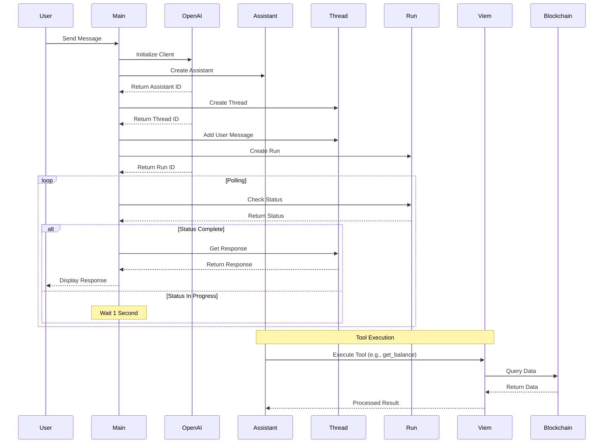

# OpenAI Assistant Project Documentation

## Project Overview

This project implements an OpenAI Assistant API integration using TypeScript. It creates a conversational AI assistant that can handle user messages and respond appropriately. The assistant is specifically configured to interact with blockchain data through Viem integration.

## System Architecture

### Core Components

1. **Assistant Creation** (`createAssistant.ts`)
   - Creates an OpenAI assistant with custom configuration
   - Uses GPT-4 model
   - Configurable with custom instructions and tools
   - Includes blockchain interaction capabilities

2. **Thread Management** (`createThreads.ts`)
   - Handles conversation threads
   - Creates new threads for each conversation
   - Manages message creation within threads

3. **Run Management** (`createRun.ts`)
   - Creates and manages execution runs
   - Implements polling mechanism for run status
   - Handles run completion

4. **Tools System** (`allTools.ts`)
   - Defines tool configuration interface
   - Provides structure for custom tool implementations
   - Extensible tool registry

5. **Blockchain Integration** (`viem/`)
   - Viem client setup for blockchain interaction
   - Configured for Celo Alfajores testnet
   - Handles blockchain queries and transactions

## System Flow Diagram



## Component Details

### Assistant Configuration

```typescript
{
    name: "Batman Fin",
    instructions: "You are a helpful assistant that can answer questions and help with tasks.",
    tools: [getBalanceTool],
    model: "gpt-4o-mini"
}
```

### Thread Structure

- Each thread represents a unique conversation
- Messages are stored with role and content
- Supports multiple messages in a single thread

### Run Management

- Creates runs with assistant ID
- Implements polling mechanism (1-second intervals)
- Handles different run statuses (in_progress, queued, completed)

### Tools System

```typescript
interface ToolConfig<T> {
    definition: {
        type: 'function';
        function: {
            name: string;
            description: string;
            parameters: {
                type: 'object';
                properties: Record<string, unknown>;
                required: string[];
            };
        };
    };
    handler: (args: T) => Promise<any>;
}
```

### Available Tools

#### Get Balance Tool
```typescript
{
    name: 'get_balance',
    description: 'Get the balance of a wallet',
    parameters: {
        wallet: {
            type: 'string',
            pattern: '^0x[a-fA-F0-9]{40}$',
            description: 'The wallet address to get the balance of'
        }
    }
}
```

### Viem Integration
```typescript
// Viem Client Configuration
const publicClient = createPublicClient({
    chain: celoAlfajores,
    transport: http()
});
```

### Technical Implementation Details

#### Viem Architecture

- Built from scratch as a standalone library
- Does not depend on ethers.js or other blockchain libraries
- Native TypeScript support with comprehensive type definitions
- Modular design for better performance and maintainability

#### Key Technical Features

- Type-safe blockchain interactions
- Modern ESM-first architecture
- Optimized for performance
- Built-in support for multiple chains including Celo Alfajores
- Smaller bundle size compared to alternatives

#### Comparison with Other Libraries

- **ethers.js**: Independent implementation, not built on top of
- **web3.js**: Different architecture and approach
- **viem**: Modern, type-safe, and performant alternative

## Usage Example

```typescript
const client = new OpenAI();
const message = "Hello, Batman! Can you get my wallet balance? My wallet address is 0x8F3d8E8aa095eb8D5A9AdD053e249955061EB358";

const assistant = await createAssistant(client);
const thread = await createThread(client, message);
const run = await createRun(client, thread, assistant.id);
const result = await performRun(run, client, thread);
```

## Technical Stack

- TypeScript
- OpenAI API
- Node.js
- ES Modules
- Viem (Blockchain Interaction)
- Celo Alfajores Testnet

## Project Structure

```
src/
├── index.ts              # Main entry point
├── openai/
│   ├── createAssistant.ts
│   ├── createThreads.ts
│   ├── createRun.ts
│   └── handleRunToolCall.ts
├── tools/
│   ├── allTools.ts
│   └── getBalance.ts
└── viem/
    └── createViemPublicClient.ts
```

## Dependencies

- openai: ^4.90.0
- typescript: ^5.8.2
- dotenv: ^16.4.7
- viem: ^2.24.1

## Development Setup

1. Install dependencies:

   ```bash
   npm install
   ```

2. Build the project:

   ```bash
   npm run build
   ```

3. Run the project:

   ```bash
   npm start
   ```

## Environment Variables

Make sure to set up your OpenAI API key in the `.env` file:

```
OPENAI_API_KEY=your_api_key_here
```

## Best Practices

1. Always handle API errors appropriately
2. Implement proper rate limiting
3. Keep API keys secure
4. Use TypeScript types for better type safety
5. Implement proper logging for debugging
6. Validate blockchain addresses before processing
7. Handle network errors gracefully
8. Implement proper error handling for blockchain queries

## UI Integration Options

### Recommended UI Libraries

1. **Next.js + Tailwind CSS**
   - Full-stack framework with built-in TypeScript support
   - Server-side rendering capabilities
   - Great for building modern web applications
   - Easy integration with OpenAI and blockchain features
   - Installation:

     ```bash
     npx create-next-app@latest --typescript
     ```

2. **React + Vite + TypeScript**
   - Fast development environment
   - Excellent TypeScript support
   - Modern build tooling
   - Installation:

     ```bash
     npm create vite@latest my-app -- --template react-ts
     ```

3. **SvelteKit**
   - Lightweight and performant
   - Great TypeScript support
   - Built-in routing and SSR
   - Installation:

     ```bash
     npm create svelte@latest my-app
     ```

### UI Component Libraries

1. **Shadcn/ui**
   - Beautiful, accessible components
   - Built on Radix UI
   - Fully customizable
   - Great TypeScript support
   - Installation:

     ```bash
     npx shadcn-ui@latest init
     ```

2. **Chakra UI**
   - Modern component library
   - Excellent accessibility
   - TypeScript-first approach
   - Installation:

     ```bash
     npm i @chakra-ui/react @emotion/react @emotion/styled framer-motion
     ```

3. **MUI (Material-UI)**
   - Comprehensive component library
   - Strong TypeScript support
   - Rich set of pre-built components
   - Installation:

     ```bash
     npm install @mui/material @emotion/react @emotion/styled
     ```

### UI Design Examples

#### Chat Interface Example

```typescript
// Example using React + Tailwind CSS
interface ChatMessage {
  role: 'user' | 'assistant';
  content: string;
  timestamp: Date;
}

const ChatInterface = () => {
  return (
    <div className="flex flex-col h-screen">
      <div className="flex-1 overflow-y-auto p-4">
        {/* Messages */}
      </div>
      <div className="border-t p-4">
        <input 
          type="text" 
          className="w-full p-2 border rounded"
          placeholder="Ask Batman about your wallet..."
        />
      </div>
    </div>
  );
};
```

#### Wallet Balance Display

```typescript
// Example using Shadcn/ui
const WalletBalance = ({ address, balance }: { address: string; balance: string }) => {
  return (
    <Card>
      <CardHeader>
        <CardTitle>Wallet Balance</CardTitle>
      </CardHeader>
      <CardContent>
        <div className="space-y-2">
          <div className="text-sm text-gray-500">Address</div>
          <div className="font-mono">{address}</div>
          <div className="text-sm text-gray-500">Balance</div>
          <div className="text-2xl font-bold">{balance} CELO</div>
        </div>
      </CardContent>
    </Card>
  );
};
```

### Integration Steps

1. Choose a UI framework (Next.js recommended)
2. Set up the project structure
3. Install necessary dependencies
4. Create reusable components
5. Implement the chat interface
6. Add blockchain integration
7. Style with Tailwind CSS or your preferred styling solution

### Best Practices for UI Development

1. Use TypeScript for all components
2. Implement responsive design
3. Follow accessibility guidelines
4. Use component libraries for consistency
5. Implement proper loading states
6. Handle errors gracefully
7. Add proper animations for better UX
8. Implement proper form validation

## Market Analysis & Similar Projects

### Similar Projects in the Market

1. **ChainGPT**
   - AI-powered blockchain analytics platform
   - Features:
     - Smart contract analysis
     - Blockchain data querying
     - Trading insights
     - Code generation for smart contracts
   - Resources:
     - Website: https://chainGPT.org
     - GitHub: https://github.com/ChainGPT-org
     - Documentation: https://docs.chainGPT.org

2. **CryptoGPT**
   - AI assistant for cryptocurrency trading
   - Features:
     - Market analysis
     - Portfolio management
     - Trading signals
     - Price predictions
   - Resources:
     - Website: https://cryptogpt.com
     - Documentation: https://docs.cryptogpt.com

3. **OpenAI's GPT-4 + Blockchain Projects**
   - Various projects using GPT-4 for blockchain analysis
   - Features:
     - Smart contract auditing
     - Blockchain data analysis
     - DeFi protocol analysis
     - Risk assessment
   - Resources:
     - OpenAI API: https://platform.openai.com/docs/guides/gpt-4
     - OpenAI Cookbook: https://github.com/openai/openai-cookbook
     - OpenAI Community: https://community.openai.com

4. **Chainlink Functions**
   - Decentralized oracle network with AI capabilities
   - Features:
     - Smart contract automation
     - Data verification
     - Cross-chain communication
     - AI-powered data analysis
   - Resources:
     - Website: https://chain.link
     - Documentation: https://docs.chain.link/chainlink-functions
     - GitHub: https://github.com/smartcontractkit/chainlink

5. **AI + DeFi Projects**
   - Projects combining AI with DeFi protocols
   - Features:
     - Automated trading strategies
     - Risk management
     - Portfolio optimization
     - Market prediction
   - Notable Projects:
     - DefiLlama: https://defillama.com
     - DeBank: https://debank.com
     - Zapper: https://zapper.xyz

### Additional Resources

1. **Development Tools**
   - Viem Documentation: https://viem.sh
   - Celo Documentation: https://docs.celo.org
   - TypeScript Documentation: https://www.typescriptlang.org/docs

2. **Learning Resources**
   - OpenAI API Guide: https://platform.openai.com/docs/introduction
   - Blockchain Development: https://ethereum.org/en/developers/
   - DeFi Learning: https://defi.learnweb3.io

3. **Community Resources**
   - Discord Communities:
     - ChainGPT: https://discord.gg/chainGPT
     - Celo: https://discord.gg/celo
     - OpenAI: https://discord.gg/openai
   - Twitter Accounts:
     - @ChainGPT_AI
     - @CeloOrg
     - @OpenAI

4. **Market Analysis Tools**
   - CoinGecko API: https://www.coingecko.com/api/documentation
   - DeFi Pulse: https://defipulse.com
   - Dune Analytics: https://dune.com

### Market Trends

1. **Growing Integration**
   - Increasing adoption of AI in blockchain projects
   - More sophisticated analysis tools
   - Better user experience through AI assistance

2. **Key Market Segments**
   - DeFi Analytics
   - Trading Assistance
   - Smart Contract Development
   - Risk Management
   - Portfolio Management

3. **Competitive Advantages**
   - Real-time blockchain data access
   - Natural language processing
   - Customizable AI responses
   - Multi-chain support
   - User-friendly interfaces

### Unique Selling Points of This Project

1. **Technical Advantages**
   - TypeScript-first approach
   - Modern Viem integration
   - Efficient polling mechanism
   - Modular tool system

2. **User Experience**
   - Conversational interface
   - Direct blockchain interaction
   - Real-time responses
   - Customizable assistant personality

3. **Development Benefits**
   - Easy to extend
   - Well-documented
   - Type-safe implementation
   - Modern architecture

### Future Market Opportunities

1. **Potential Expansions**
   - Multi-chain support
   - Advanced analytics
   - Trading capabilities
   - Smart contract interaction
   - Portfolio management

2. **Market Niches**
   - DeFi protocol analysis
   - Blockchain education
   - Trading assistance
   - Development tools
   - Risk assessment

3. **Integration Possibilities**
   - Wallet integration
   - DEX integration
   - NFT analysis
   - DAO governance
   - Cross-chain operations

## AI-Powered Blockchain Wallets & Financial Services

### AI Wallets

1. **Argent**
   - Features:
     - AI-powered security
     - Smart contract wallet
     - Social recovery
     - DeFi integration
   - Resources:
     - Website: https://www.argent.xyz
     - Documentation: https://docs.argent.xyz

2. **Rainbow**
   - Features:
     - AI-driven portfolio insights
     - NFT management
     - DeFi integration
     - Cross-chain support
   - Resources:
     - Website: https://rainbow.me
     - App Store: https://apps.apple.com/app/rainbow-ethereum-wallet/id1457119021

3. **Exodus**
   - Features:
     - AI portfolio tracking
     - Multi-chain support
     - Built-in exchange
     - NFT support
   - Resources:
     - Website: https://www.exodus.com
     - Documentation: https://support.exodus.com

### AI Financial Services

1. **DeFi Platforms**
   - **Aave**
     - AI-powered lending protocols
     - Risk assessment
     - Website: https://aave.com
   
   - **Compound**
     - AI-driven interest rates
     - Market analysis
     - Website: https://compound.finance

2. **Trading Platforms**
   - **3Commas**
     - AI trading bots
     - Portfolio management
     - Website: https://3commas.io

   - **TradingView**
     - AI technical analysis
     - Market predictions
     - Website: https://www.tradingview.com

3. **Portfolio Management**
   - **Zapper**
     - AI portfolio tracking
     - DeFi analytics
     - Website: https://zapper.xyz

   - **DeBank**
     - AI portfolio insights
     - DeFi tracking
     - Website: https://debank.com

### AI Security Services

1. **CertiK**
   - AI-powered security audits
   - Smart contract analysis
   - Website: https://www.certik.com

2. **OpenZeppelin**
   - AI security tools
   - Smart contract protection
   - Website: https://openzeppelin.com

### AI Analytics Platforms

1. **Nansen**
   - AI wallet analysis
   - Market insights
   - Website: https://nansen.ai

2. **Dune Analytics**
   - AI data visualization
   - Blockchain analytics
   - Website: https://dune.com

### Emerging AI Blockchain Services

1. **AI-Powered DEXs**
   - **Uniswap**
     - AI price predictions
     - Liquidity analysis
     - Website: https://uniswap.org

   - **Curve**
     - AI yield optimization
     - Market analysis
     - Website: https://curve.fi

2. **AI Lending Platforms**
   - **Aave**
     - AI credit scoring
     - Risk assessment
     - Website: https://aave.com

   - **Compound**
     - AI interest rate optimization
     - Market analysis
     - Website: https://compound.finance

### Key Features Across Services

1. **Security**
   - AI threat detection
   - Fraud prevention
   - Risk assessment
   - Smart contract auditing

2. **Analytics**
   - Market prediction
   - Portfolio optimization
   - Risk analysis
   - Performance tracking

3. **User Experience**
   - Personalized insights
   - Automated trading
   - Smart notifications
   - Custom dashboards

4. **Integration**
   - Multi-chain support
   - DeFi protocol integration
   - Cross-platform compatibility
   - API access

### Market Leaders by Category

1. **Wallets**
   - MetaMask (with AI plugins)
   - Argent
   - Rainbow

2. **Trading**
   - 3Commas
   - TradingView
   - Binance (AI features)

3. **Analytics**
   - Nansen
   - Dune Analytics
   - Glassnode

4. **Security**
   - CertiK
   - OpenZeppelin
   - Trail of Bits
